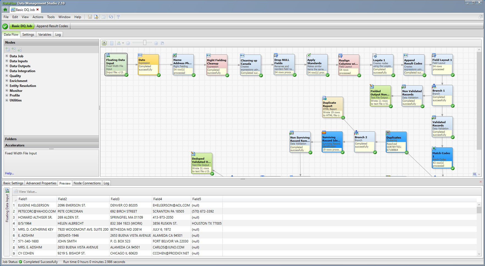
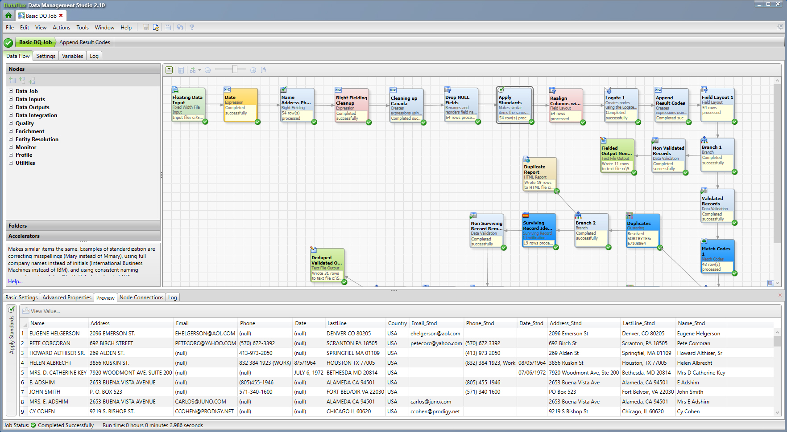
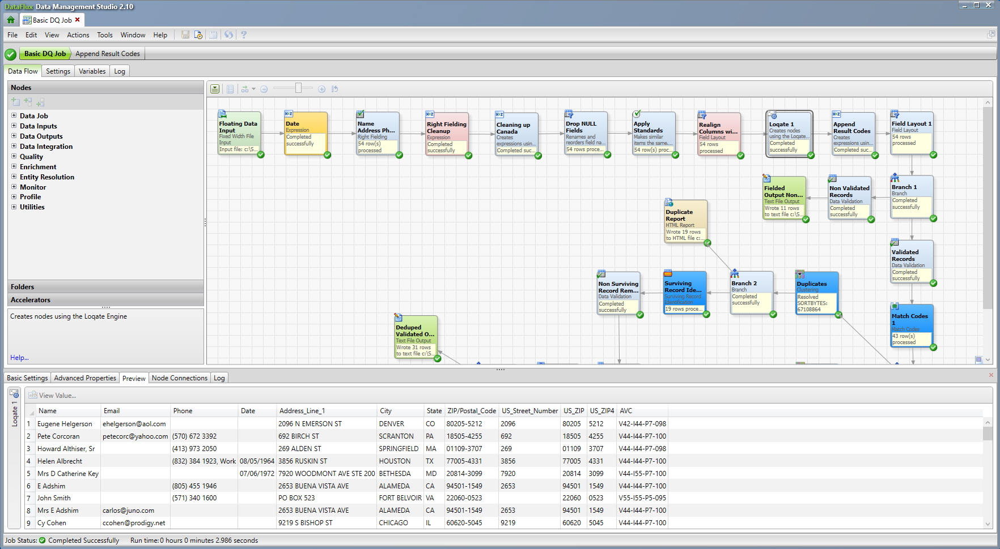
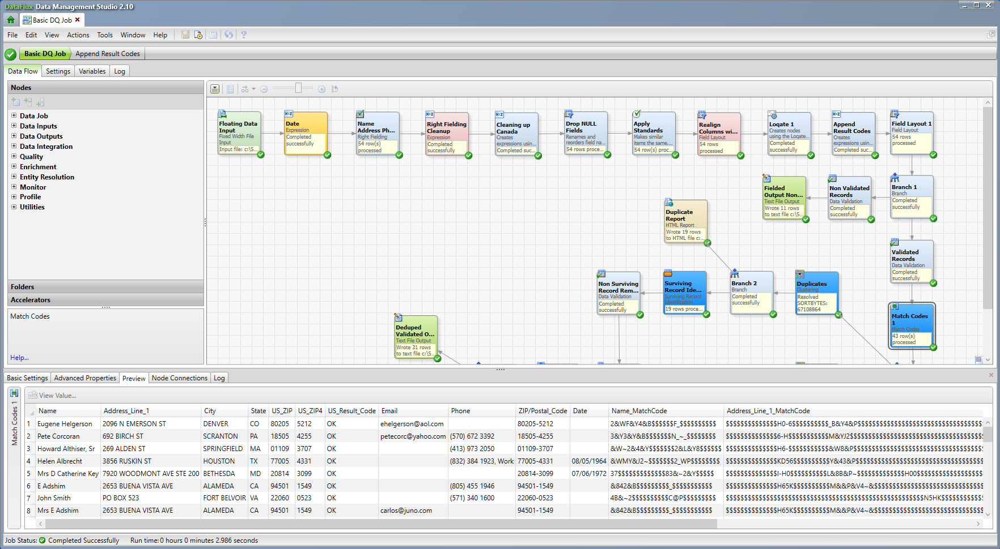
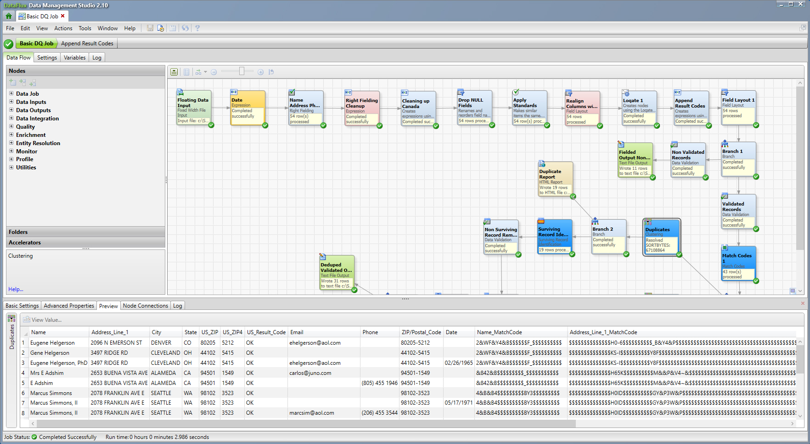
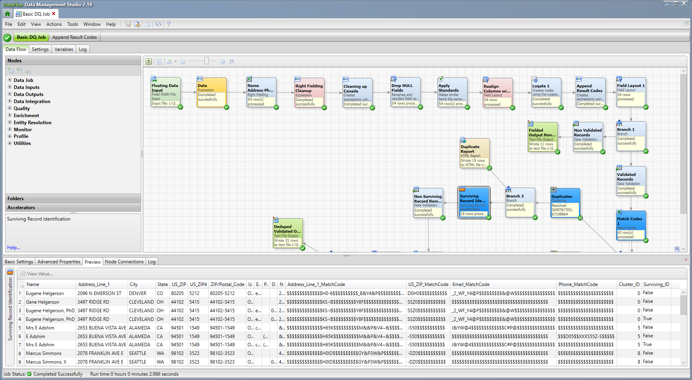
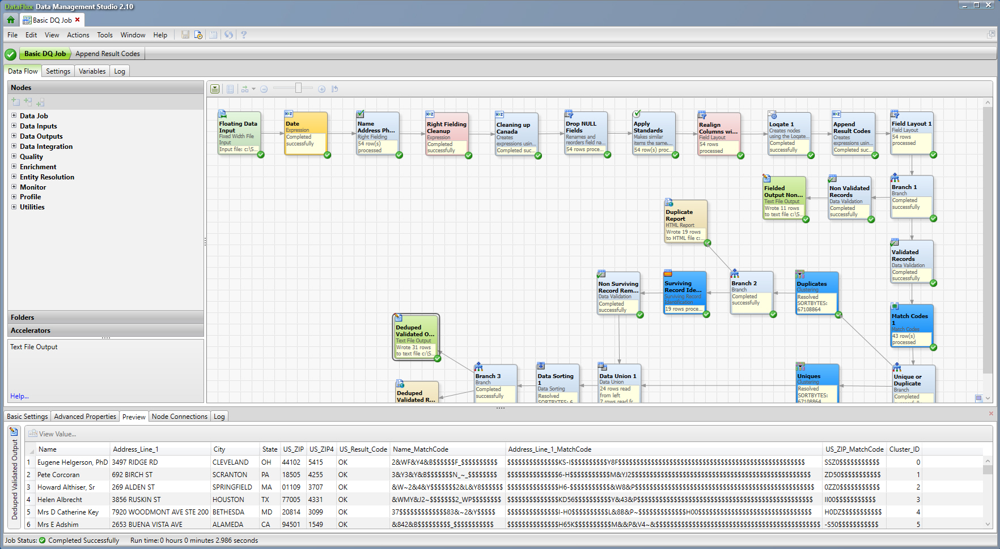

## (DataFlux) Basic DQ Job

#### Description

------

The DQ Basic Functionality job is a great example job for people looking to see what DataFlux can do as far as data quality is concerned.  

- The job starts with taking un-fielded data that cannot be easily cleaned or used for anything and running it through the "Right Fielding" node so that we can take the data and field it by the data type.  This allows users to with only a couple of steps to take data and turn it from unusable to usable data.  
  
- After the data has been fielded, we use the QKB to standardize fields like name, last line, address, date, and phone.  All of this standardization work is completed without the user needing to write a single line of code.
    
- Next we run the address line and last line through our address verification step using our 3rd party data provider, Loqate.  This will help us to validate addresses so we can determine deliverability.  Once we have the addresses verified, we split off any unverified addresses.  There is no reason to send undeliverable records through the rest of the process if the goal is tor print and mail something. 
    
- The next step in the job is to run the data through a matching process.

  First we take the records and using the QKB generate match codes, an encoded representation of a data token, Name, Address, Phone, etc.  This step introduces "fuzziness" to the tokens.

  Secondly we take and run the records through a clustering process where we group like records together.  Because of the match codes and the matching logic in the match codes, it easy for us to cluster or group Bill and William, Peg and Margarette, Mickey and Michael, etc.

  The last optional step in the matching process is to take the clusters and build one surviving or golden record that is the best representation of the records in the cluster.
    

    

    
- The end of this job, brings the unique and the surviving or de-duped records back together into a single output file that is ready for downstream analytics.  You can see that all of the records in the output file are now unique because the Cluster_ID now only contains unique numbers.
    

| Job Specifics    | Explaination                                                 |
| ---------------- | ------------------------------------------------------------ |
| Data Source      | messy.txt                                                    |
| QKB Version      | CI33                                                         |
| DataFlux Version | 2.10                                                         |
| Loqate           | USA address data pack and optionally the Canadian data pack.  This data can be downloaded from the SAS Support site at:  [SAS Downloads: Loqate US Data](https://support.sas.com/downloads/package.htm?pid=2387) |

#### Change Log

------

Version 1.0 (10/09/2025)

- Initial Version
