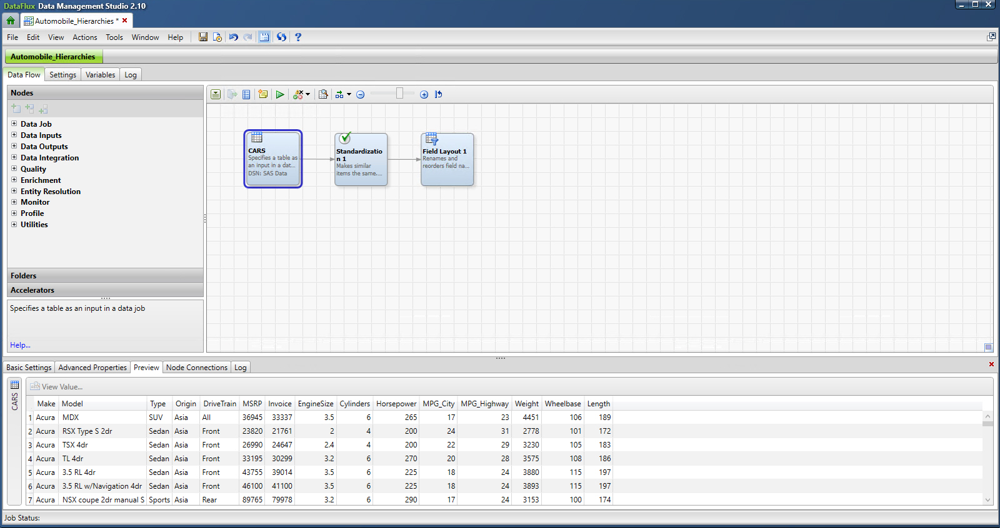
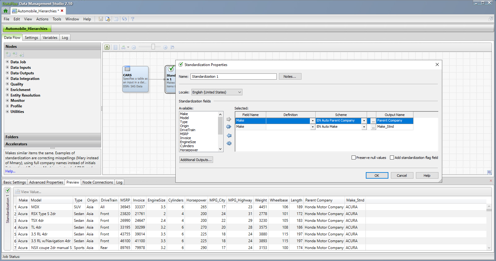
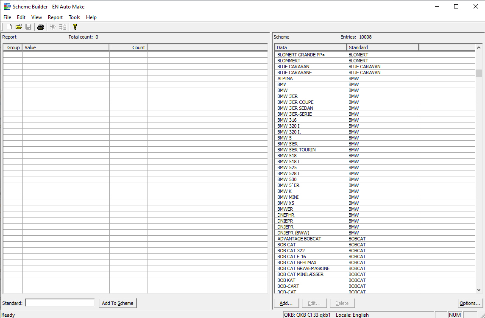
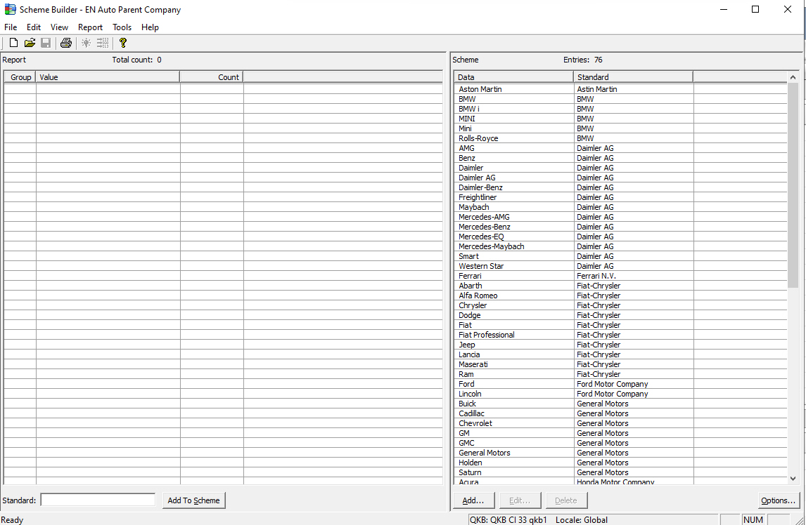

## (DataFlux) Custom Scheme Automobile Hierarchies

#### Description

------

The Custom Scheme Automobile Hierarchies is a great example of using a custom scheme inside of the QKB to add information to the QKB for use in jobs.  In this situation, we created a standardization scheme from the cars database so that models numbers would be dropped and a BMW 528 would become BMW.  Then we created a standardization list of automobile parent companies so that Chevrolet, Holden, GMC, Chevy, Buick, Saturn, etc. would standardize to General Motors.  

The job starts with the SAS Cars data set.  This data set gives us make, model, and other bits of information about a wide range of cars.  

We add a standardization node to the workflow and then we take the Make field and add it twice to the Standardization node.  In one line we add the EN Auto Parent Company standardization scheme that we built for this demo.  This standardization scheme will generate from the make the parent company of the make using the Parent scheme.  Next we add the EN Auto Make scheme so that we can standardize the make of the car and drop any extraneous information.  All of this custom standardization work can be completed completely from inside of the DataFlux solution by using its profiling capabilities and then creating custom schemes out of the profiling exercise.  All of this can be completed without the user needing to write a single line of code.

Below is a screenshot of the EN Auto Make custom scheme.  If you look at the BMW section, you can see that within the DataFlux profiling component we identified a myriad of different makes of BMW.  This custom scheme takes all those different flavors of the BMW model and standardizes them to just BMW.

Below is a screenshot of the EN Auto Parent Company custom scheme.  If you look at the Fiat-Chrysler section, you can see that within the DataFlux profiling component we identified a myriad of different makes of cars that ultimately fall into the Fiat-Chrysler parent company.  This custom scheme takes all those different flavors of cars (Alfa Romeo, Chrysler, Dodge, Fiat, Jeep, etc. and standardizes them to just Fiat-Chrysler.

 

| Job Specifics    | Explanation                                          |
| ---------------- | ---------------------------------------------------- |
| Data Source      | cars.sas7bdat                                        |
| QKB Version      | CI33                                                 |
| DataFlux version | 2.10                                                 |
| Custom Schemes   | EN Auto Make.sch.qkb and Auto_Parent_Company.sch.qkb |

#### Change Log

------

Version 1.0 (10/09/2025)

- Initial Version
