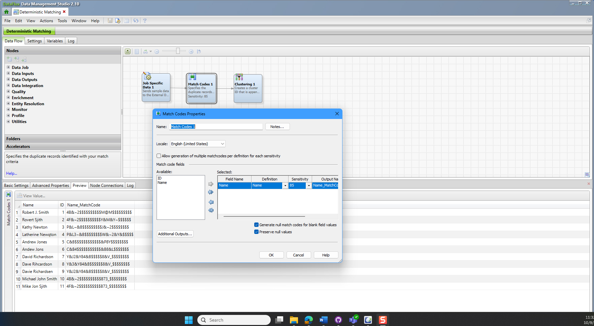
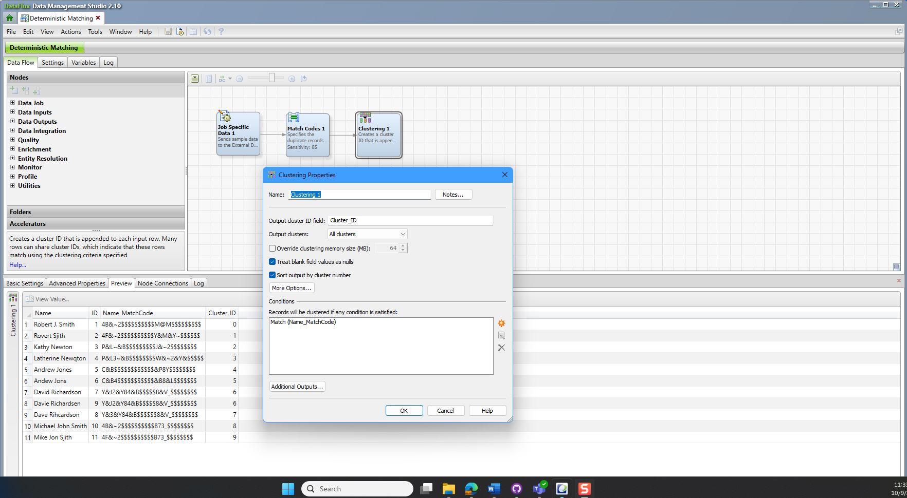

## (DataFlux) Deterministic (Rules) Matching

#### Description

------

The Deterministic based matching is a good example of how rules based matching with a single token can be problematic.  In this example of deterministic matching, you only have a name token and it has some significant mis spellings which cause the matching to not catch programmatically what the human eye can catch visually.  In this situation we rely on the natural fuzziness of the QKB for name match coding and look to its ability to find matches by varying the sensitivities and scoring the output without human intervention. 

The job starts with a Job Specific data node that is creating an 11 record data set of names.  This is the same data set that is used in the probabilistic matching example so that you can compare apples to apples.   

We add a standardization node to the workflow and then we choose the Name definition.  This definition will perform all the standardization capabilities of the QKB and then create a match code for the name token.  

When we get to the clustering node, we now will match on the Name_MatchCode to try and pull the different spelling variations, when appropriate into the appropriate cluster.  In the example below, you can see that Robert J. Smith and Rovert Sjith do not match when a simple string comparison is done of the Name_MatchCode field.  When you compare the output of the Probabilistic and Deterministic matching of this small data set, you will see that the probabilistic job does match the names, but it runs much slower and does introduce the risk of overmatching.  These two examples show why multiple tokens should be used to perform the best matching.  

| Job Specifics    | Explanation                                |
| ---------------- | ------------------------------------------ |
| Data Source      | Job Specific data contained within the job |
| QKB Version      | CI33                                       |
| DataFlux version | 2.10                                       |

#### Change Log

------

Version 1.0 (10/09/2025)

- Initial Version
