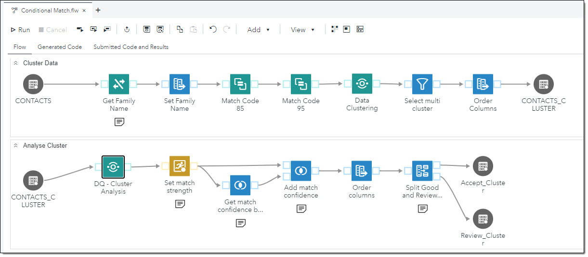

# Conditional Matching with SAS Studio Flow
## Description
This demo shows a way to evaluate cluster results. We analyse the cluster matches based on cluster rules to decide if we accept a cluster automatically or if we manually review a cluster before accepting it. 
The flow has two swimlanes: 

**Swimlane: Cluster Data** 
In this swimlane we read contact information, separate the surname from the name, generate match codes and cluster the data.

**Swimlane: Analyse Cluster** 
In this swimlane we use the custom step [*DQ Cluster Analyse*](https://github.com/sassoftware/sas-studio-custom-steps/tree/main/DQ%20-%20Cluster%20Analysis) to identify which cluster rules were triggered in step 'Data Clustering' for a cluster member to join a cluster. (*This is the equivalent to the 'Condition matched' option in the Clustering node in DataFlux Data Management Studio*.) 
Next we rate how good a record match was by adding points for each rule that was triggered, so that a record gets 100 points if all cluster rules were triggered. 
At the end of the swimlane we split the cluster result into two datasets. One dataset with all clusters that we want to accept automatically (where for each record in a cluster all cluster rules were triggered) and one dataset where we want to review clusters before we accept them.

| Job Specifics | Comment |
| --- | --- |
| Data Source | SASDQREF \| Contacts |
| QKB Version | CI 33 |
| SAS Studio License Level | Engineer |
| Custom Step Data Clustering | [DQ - Clustering](https://github.com/sassoftware/sas-studio-custom-steps/tree/main/DQ%20-%20Clustering) |
| Custom Step DQ - Cluster Analysis | [DQ- Cluster Analysis](https://github.com/sassoftware/sas-studio-custom-steps/tree/main/DQ%20-%20Cluster%20Analysis) |

### Install
---
 To install this demo, follow the instructions in folder [demo](./demo).

### Change Log
---
Version 1.0 (30SEP2024)
* Initial Version
