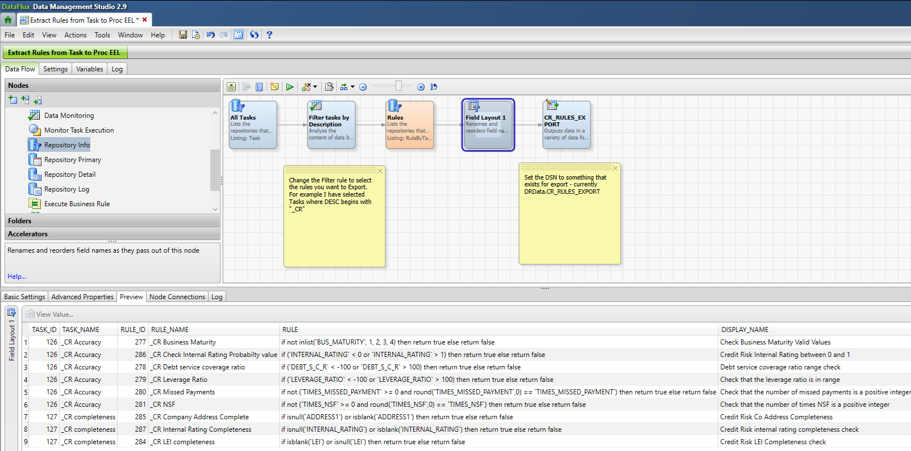

This demo shows how Data Quality Business Rules can be exported from DM Studio and executed in SAS Studio on Viya, making use of Proc EEL. 

## Step 1: Extract the Rules to a dataset. 

In DM Studio, import the job Extract Rules from Task to Proc EEL.dpf.
The job will need to be saved to a folder which is linked to the repository containing your rules.

The Filter tasks by Description node will need to be changed to select the rules you need... I have a simple "starts with" rule. 

You will also need to make sure that you have a SAS Library DSN for the export dataset, CR_RULES_EXPORT. Mine is called DrData. Change the name as appropriate. 

Run the Job. You should have a dataset with one row per rule, including the Task and Rule metadata, rule name, rule code, description and comment. 

## Step 2: Import the dataset you just created and the Source Data into Viya.

In my example I have uploaded both to the PUBLIC CAS Library

## Step 3: Prepare the SAS Studio Job

