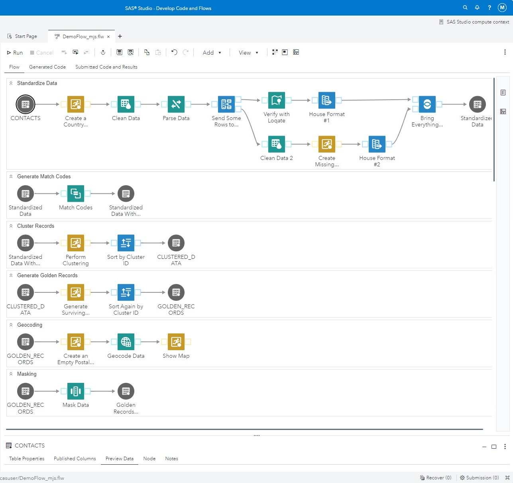

## DQ Basic Functionality Viya4

#### Description

------

The DQ Basic Functionality Viya4 job is intended to use data that ships with Viya4 to showcase basic data quality functionality.  

- The job starts by taking dirty data and running it through standardization, parsing, and either address standardization via the QKB or address verification with Loqate.  
- After that we take the data through a traditional entity resolution or matching set of swimlanes that showcase the process of  (generating match codes, clustering, and then survivorship).  
- The next swimlane takes advantage of Proc Geocode to provide some geocoding information outside of the Loqate functionality.
- The final swimlane of this job showcases the data masking functionality built into the Quality Knowledge Base.

| Job Specifics            | Explaination                                                 |
| ------------------------ | ------------------------------------------------------------ |
| Data Source              | SASDQREF \| Contacts                                         |
| QKB Version              | CI33                                                         |
| SAS Studio License Level | Engineer                                                     |
| Proc Geocode             | The Proc Geocode swimlane will generate a warning on the Show Map transformation if all of the data tables for Proc Geocode are not loaded into the Viya instance.  For more information about the Proc Geocode Downloads, please see:  [`Geocode Data`](https://support.sas.com/en/knowledge-base/maps-geocoding/geocodes.html) |
| Create a Country         | The Loqate transformation needs a country code so that it can run the Verify with Loqate step |
| Verify with Loqate       | There is an R&D key in the node that will let users process 100 transactions a day.  If you need more than 100 transactions a day, please contact mickey.schauf@sas.com and he will work with you to get a Loqate key with more transactions per day. |

#### Change Log

------

Version 1.0 (08/22/2024)

- Initial Version