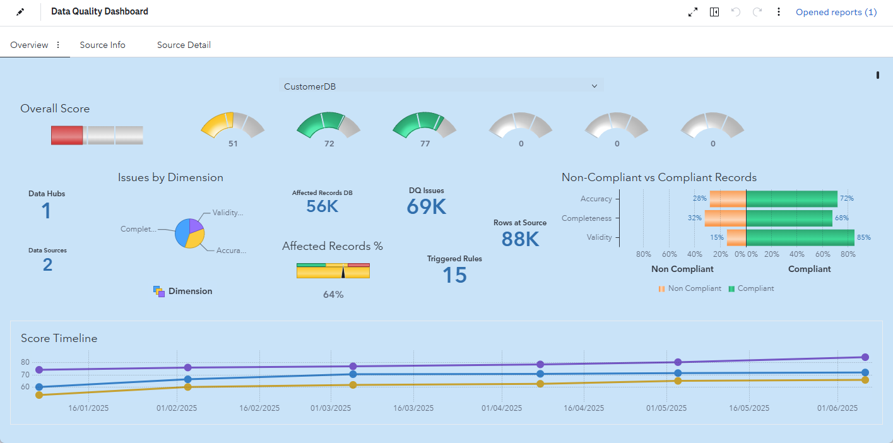

# Data Quality Dashboard
This demo showcases how SAS Viya can be used to build a comprehensive data quality dashboard. The dashboard provides a centralized view of key metrics that reflect quality dimensions like validity, accuracy, completeness, or consistency of data across the organization. Using SAS Intelligent Decisioning, business rules are defined to monitor data quality at the field level. These rules are executed through SAS Studio flows, which process the monitoring data and prepare it for visualization. The results are then presented using SAS Visual Analytics, offering an intuitive graphical representation of data quality across various dimensions—down to individual records.

## Artifacts
### All necessary files are here:  [Global Technology Practice / Fingertips workshops / DQ-Dashboard · GitLab](https://gitlab.sas.com/gtp/fingertips/dq-dashboard)
