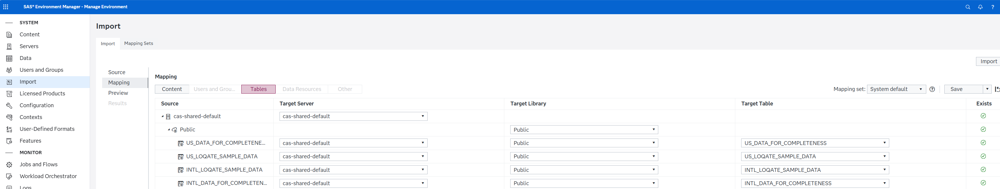
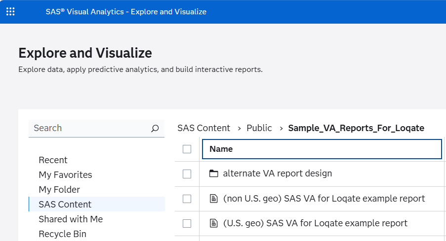
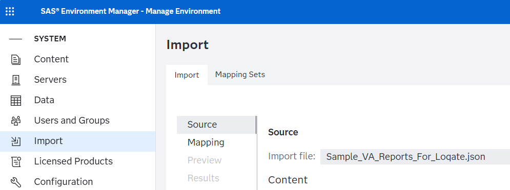
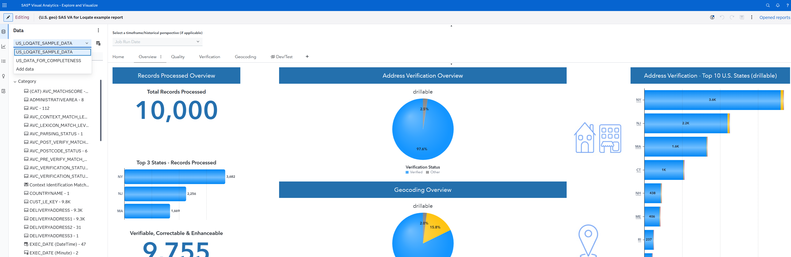

# Loqate Address Verification Results Report 

## Overview

The Address Verification Report allows Loqate users to generate a visual report showing how address processing using Loqate has improved the quality of the data.  Please note that in this report we have two input files, one that is pulling in processed address data and one that is pulling in the statistical results of the data for visualization.

## Included Files

| Files                             | Definitions                                                  |
| :-------------------------------- | :----------------------------------------------------------- |
| Sample_VA_Reports_For_Loqate.json | This is the VA export from Viya 4.  The Report has the following tabs: Home Overview Quality Verification Geocoding<>Dev/test |
| US_Loqate_for_VA_Report.ddf       | This is a DM Studio 2.10 job that can be used to create the input data for the US version of the Loqate VA Report |
| INTL_Loqate_for_VA_Report.ddf     | This is a DM Studio 2.10 job that can be used to create the input data for the International version of the Loqate Report |
| US_Loqate_for_VA_Report.flw       | This is a SAS Studio flow that can be used to create the input data for the US version of the Loqate VA Report |
| INTL_Loqate_for_VA_Report.flw     | This is a SAS Studio flow that can be used to create the input data for the INTL version of the Loqate VA Report |
| US_sample_address.sas7bdat        | This is a sample address data set containing 10K records  This file only contains: Cust_le_key Address City State ZIP |
| INTL_sample_address.sas7bdat      | This is a sample address data set containing 10K records  This file only contains: Cust_le_key Addr_Line_1 Addr_line_2 City Postal_Code Country_Name |
| US_output_Loqate_stats.txt        | This is a small tab delimited file that has some processing stats for the Loqate report. |
| INTL_output_Loqate_stats.txt      | This is a small tab delimited file that has some processing stats for the Loqate report. |

## Installation Instructions

1. From SAS Environment Manager, the data files need to be loaded into CAS In-Memory first.  Load them into a CASLIB that VA Report Designers/viewer can access.  NOTE:  if you want to show both the US and INTL Loqate reports, you will need to load all 4 data files.
    

2. From SAS Environment Manager, the Sample_VA_Reports_For_Loqate.json should be imported to SAS Content > Public > Sample_VA_Reports_For_Loqate.  NOTE the person importing the JSON file will need to have create/write/update to the SAS Content > Public folder.

    
    

3. After a successful import of the JSON file, users should be able to open SAS VA and from SAS Content see the Sample_VA_Reports_For_Loqate report.

    
    

4. Once the report has successfully loaded the Overview of the tab will look like this.

    

